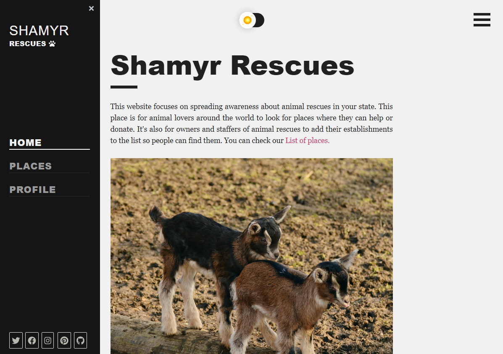

# Shamyr Rescues 

Frontend can be found in [Shamyr Rescues React](https://github.com/prixladi/shamyr-rescues-react) repository. 
Backend can be found in [Shamyr Rescues Server](https://github.com/prixladi/shamyr-rescues-server) repository.

## Data

Folder [/data](data) contains default email templates. File [/Data.md](Data.md) contains JSON data that can be used to initialize Database (Client and email templates).

## Docker

### `docker-compose up`

Runs production-ready containers with configuration specified in [/docker-compose.yml](docker-compose.yml).

## Images from app

